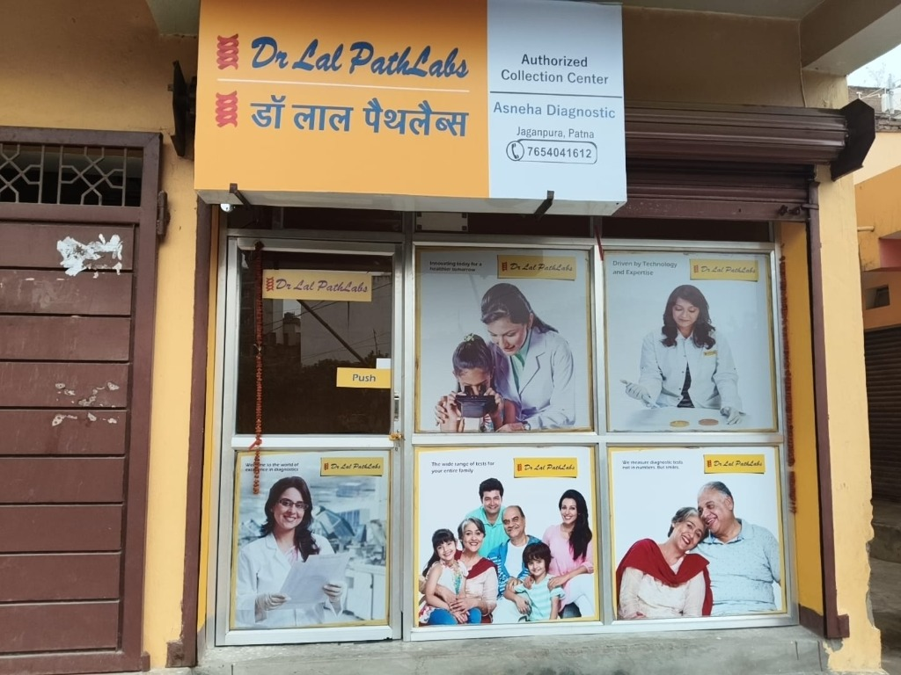

# Asneha Diagnostic — Dr Lal PathLabs Authorized Collection Center

Official website and appointment booking portal for **Asneha Diagnostic** (अस्नेहा डायग्नोस्टिक), the Authorized Collection Center of **Dr Lal PathLabs** located in **Jaganpura, Patna, Bihar**.



---

## 🏥 About the Center

- **Franchise Entity**: Asneha Diagnostic
- **Brand Affiliation**: Authorized Collection Center of Dr Lal PathLabs (75+ Years of Trust)
- **Center In-Charge**: Ajay Kumar (DMLT)
- **Helpline / WhatsApp**: [+91 7654041612](tel:7654041612)
- **Address**: East of Double Transformer, New Jaganpura Colony, Base Nagar, Patna - 800027, Bihar
- **Hours**: Monday to Sunday: 7:00 AM – 8:00 PM (Home sample collection starts early at 6:30 AM)

---

## ✨ Features

- **Dr Lal PathLabs Swasth Fit™ Preventive Healthcare Packages**:
  - **Swasth Fit Super 1** (₹1,250): Sugar, Thyroid, Lipid Basic, LFT & KFT (52+ Parameters)
  - **Swasth Fit Super 2** (₹1,550): Super 1 + HbA1c + Complete Blood Count (74+ Parameters)
  - **Swasth Fit Super 3** (₹2,250): Super 1 + Vitamin-D + Vitamin-B12 (68+ Parameters)
  - **Swasth Fit Super 4** (₹2,550) ★ *Most Popular*: Sugar, Thyroid, Lipid, LFT, KFT, HbA1c, Vit D & B12, CBC (88+ Parameters)
  - **Swasth Fit Complete** (₹5,200): Executive Full Body Panel adding Iron Studies, Apo A1 & B, Amylase, HsCRP, Hemogram, Urine Routine (110+ Parameters)
  - Interactive **Comparison Matrix** and original clinic tariff poster viewer.
- **Over 5,000+ Pathology Tests**:
  - Real-time searchable diagnostic tests catalog (CBC, Lipid Profile, Thyroid, Liver & Kidney, HbA1c, Dengue, Urine Routine, Ferritin, etc.).
- **Free Home Sample Collection Booking**:
  - Real-time online booking with patient name, contact, Patna address/landmark, and preferred morning time slot.
  - Automated unique Booking ID generation (`ASNEHA-XXXXX`).
  - Instant WhatsApp alert prefilled directly to Ajay Kumar (+91 7654041612).
- **Reception Staff Admin Portal (`/admin`)**:
  - Live dashboard to view and manage patient requests.
  - Filter by status (`Pending`, `Confirmed`, `Sample Collected`, `Completed`).
  - One-tap direct call and WhatsApp messaging to patients.
- **GSAP 4-Directional Animation Engine**:
  - Coordinated ScrollTrigger animations revealing elements from left, right, upward, and downward.
  - Floating trust badges and smooth spring easing.
- **Patient Consumer Rights Charter**:
  - Transparent verification guidelines, computerized bill generation, and automatic SMS/WhatsApp critical alerts.

---

## 🛠 Tech Stack

- **Framework**: [Next.js 15](https://nextjs.org/) (App Router, React 19, TypeScript)
- **Styling**: Tailwind CSS & Modern Design Tokens
- **Typography**: Google Fonts (Outfit & Plus Jakarta Sans)
- **Animations**: [GSAP 3](https://greensock.com/gsap/) with ScrollTrigger
- **Database**: [MongoDB](https://www.mongodb.com/) via Mongoose (with automated local fallback store)
- **Icons**: Lucide React

---

## 🚀 Getting Started

### 1. Clone & Install

```bash
git clone https://github.com/sin-07/drPathLab.git
cd drPathLab
npm install
```

### 2. Environment Setup (Optional)

Create a `.env.local` file in the root directory:

```env
MONGODB_URI=mongodb+srv://<username>:<password>@cluster.mongodb.net/drpathlab?retryWrites=true&w=majority
```

*(Note: If `MONGODB_URI` is omitted, the application operates seamlessly using its built-in in-memory fallback store.)*

### 3. Run Locally

```bash
npm run dev
```

Open [http://localhost:3000](http://localhost:3000) to view the website, and [http://localhost:3000/admin](http://localhost:3000/admin) to access the staff portal.

---

## 📄 License

Proprietary &copy; Asneha Diagnostic. Authorized Collection Center of Dr Lal PathLabs Ltd.
